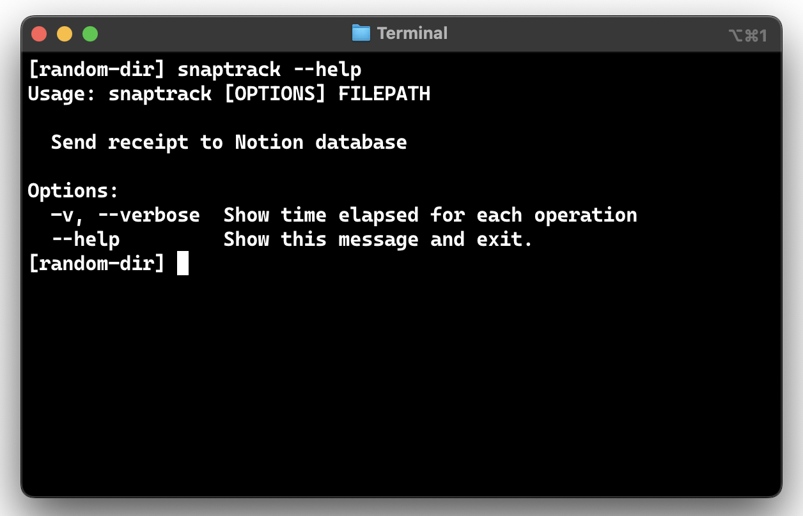

# SnapTrack :chart_with_upwards_trend:

- [Demo](#demo)
- [Installation](#installation)
- [Usage](#usage)
- [Credits](#credits)

-----

SnapTrack is a cutting-edge Python CLI tool that combines AWS Rekognition's image processing prowess with the intelligence of GPT-3.5. 

Just snap a photo of any receipt, provide its file path, and watch as SnapTrack accurately extracts each item, automatically updating your Notion finance tracking sheet. Say goodbye to the tedious task of manual entry and hello to effortless finance management. 

SnapTrack is perfect for anyone looking to simplify their expense tracking with technology. Keep your finances in check effortlessly and focus on what you love. Embrace the ease of financial tracking with SnapTrack!

## Demo

Here's a random receipt from [Pinterest](#credits):

https://github.com/isobarbaric/SnapTrack/assets/76544615/d0f43ee2-c986-4207-a8dd-fe10cbfd049e      

Notice how every entry - with the right price - was loaded into the database, as desired.

### Using the ``--verbose`` flag

https://github.com/isobarbaric/SnapTrack/assets/76544615/0bec78af-45e3-4fd3-869d-11bb43843e04

## Installation
1. Install Poetry
`pip install poetry`

2. Clone this repository:
``git clone https://github.com/isobarbaric/SnapTrack``

3. Navigate to the cloned directory (and in the root directory):
``cd snaptrack``

4. Build the wheel for the module:
``poetry build``

5. Install the module:
``pip install snaptrack-0.1.0-py3-none-any.whl``

Now, you can use the `snaptrack` command from your terminal.

## Usage
To run SnapTrack, use:
``snaptrack FILEPATH``

For more information, feel free to use the ``--help`` flag.

## Credits
- Image from [Pinterest](https://www.pinterest.ca/pin/receipt--282952789077533732/)
